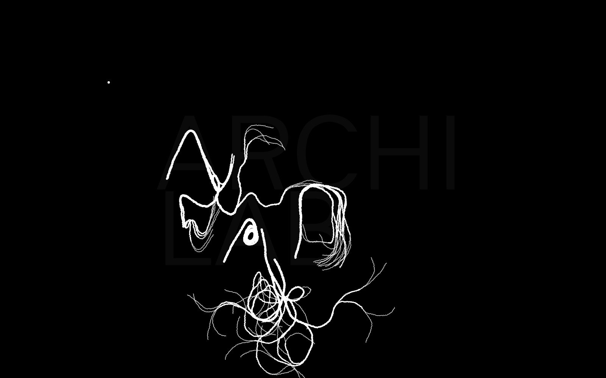

# Bioglyphes

Bioglyphes est le projet fondateur du groupe de recherches ngraphes.

En 2013, à l’occasion de la publication catalogue de l'exposition Archilab 2013 dont le thème était `Naturaliser l'architecture` les [éditions HYX](http://www.editions-hyx.com/fr/livres/naturaliser-larchitecture-archilab-2013) ont réuni une équipe pour élaborer une une série d’images typographiques génératives pour les titrages et la couverture du catalogue en cohérence avec le contenu de l'exposition et de l'ouvrage. 

## Intentions plastiques

L'intention était de créer une simulation d'éléments en croissance qui devaient être issus de caractères typographiques et dont ils seraient des extension. Bien que clairement artificielle la simulation  sera inspirée du végétal (lianes, racines, racidules...), de l'organique (réseaux de neurones, structures osseuses...), ou de matières artificielles issues de recherches bio-mimétiques à l'échelle microscopique (nanofibres...).

## L’algorithme 

Pour réaliser les titres le catalogue l’équipe à élaboré un générateur graphique. Il s’agit un algorithme de simulation de croissance végétale dont l'objet est de créer des images des images génératives à partir de typographies.

Son principe, est une interaction entre des formes générées par un programme de type L-système et les contours de caractères typographiques pré-existants ou de toute autre forme vectorielle. 

La matière graphique générée est composée de branches (ou tendrils), qui croissent à partir d'un point d'origine (seed) défini par l'utilisateur et qui se subdivisent sur une certain nombre de générations. Leur apparence et les modalités de leur croissance sont déterminés par des paramètres qui sont aussi définis par l'utilisateur et manipulés en temps réel pendant la création, ce qui lui permet de guider et contrôler la génération graphique.

L'utilisateur va donc inséminer le caractère en définissant les points d'origine (seeds) à l'intérieur ou à proximité immédiate du contour de la lettre ou du tracé vectoriel, et les branches vont réagir à  ces formes pendant leur croissance, en poussant dedans ou autour de cette structure graphique, plus ou moins poreuse, remplissant, épousant, ou contournant sa forme selon des principes de contournement, d'enveloppement, de remplissage...

L’algorithme a été développé  dans l’environnement [Processing](http://processing.org) (Ben Fry et Casey Reas) avec les librairies [Geomerative](http://www.ricardmarxer.com/geomerative/) (Richard Marxer) et [ControlP5](http://www.sojamo.de/libraries/controlP5/) (Andreas Schlegel)

## Aperçu

version naturarchi_3

## Prérequis

- processing 2.0.x
- Geomerative rev 39